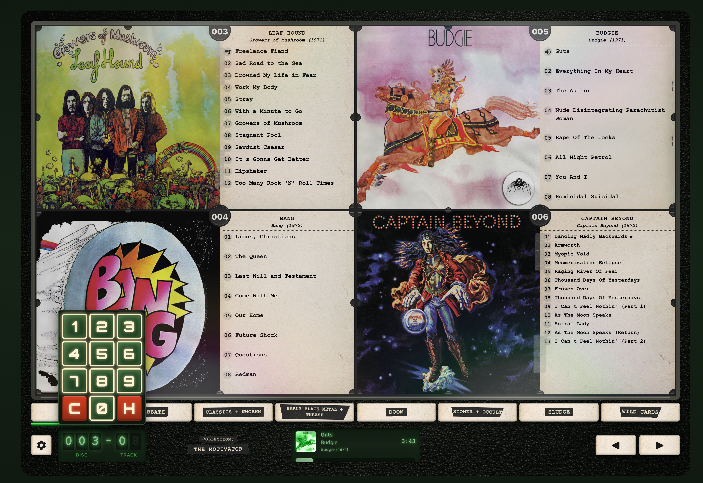

# Dive Bar Jukebox

A retro-style digital jukebox application that replicates the look and feel of 90s/early 2000s NSM-style CD wall jukeboxes.



## Features

### Admin Features
- **Local FLAC File Support**: Play high-quality FLAC files from a local library
- **Spotify Sync**: Includes tools and scripts for building JSON files and scripts of your Saved Music on Spotify and Tidal to be easily used with solutions like tital-dl-ng and SpotiFLAC if desired. 
- **Spotify Integration**: Syncs database with album and track data from Spotify for optional playback through Spotify web api (for deployed version only).
- **Library Scan**: Scans and updates local music library and updates SQL database, so that all Display data for Albums and Tracks can be edited while file metadata goes unchanged. 
- **Multi-Collection Management**: Create multiple jukebox Collections, that can feature a different set of Albums
- **Flexible Album Numbering**: Dynamic display numbers (001-999) based on sort order
- **Customizable Ordering, and Color Coded Sections**: Albums in a collection can be put in a custom order, and given specific slot placement. Albums can also be put into sections for easy jump-to navigation with custom color coding. 
- **Selective Track Inclusion**: Each album shown in the Jukebox can be edited so that only selected tracks display, and individual tracks can be archived to prevent playback during full album play. 
- **Favorites and Recommendations**: Songs can be marked as "Favorite" or "Recommended", to be displayed to the user on info cards while searching for songs. Songs marked as "Favorite" will also be included in Autoplay feature. 
- **Edit Modal Track Player**: Admin users can listen to individual tracks and use progress bar to preview different sections of songs while choosing favorites and selecting songs. 

### User Interface / Jukebox View
- **Jukebox View**: The main jukebox view is built to be used on Horizontal iPad Screens, Desktops, or touch screen interfaces. 
- **Controls** The UX is intended to replicate the simplicity, and primitive controls of a vintage jukebox. With left/right arrow keys for flipping through Cards, and a pop out number pad for selecting songs for the Queue on touch screen devices. 


## Architecture
- **Backend**: Python FastAPI with SQLite database
- **Frontend**: React + TypeScript + Vite
- **Music Sources**: Local FLAC files (Spotify/Tidal support planned)
- **Deployment**: Local web app for at home use with iPad, hosted demo (in development), Raspberry Pi standalone (future)

## Getting Started

### Prerequisites

- Python 3.11+
- Node.js 18+
- FLAC music library

### Backend Setup
```bash
cd backend
python3 -m venv .venv
source .venv/bin/activate  # On Windows: .venv\Scripts\activate
pip install -r requirements.txt
cp ../.env.example .env
# Edit .env with your music library path
uvicorn app.main:app --reload --port 8000
```

### Creating the first admin user (owner of existing collections)

The first user is the one who “owns” all collections and albums that were created before multi-user support (or that the ownership migration assigned).

**Option 1 – Seed from environment (recommended)**  
1. Run migrations so the DB has the `users` table and ownership columns:  
   `cd backend && alembic upgrade head`  
2. In `.env` (or environment), set:  
   `ADMIN_SEED_EMAIL=your@email.com`  
   `ADMIN_SEED_PASSWORD=your-secure-password`  
3. Start the backend:  
   `uvicorn app.main:app --reload --port 8000`  
4. On first startup the app will either create that user or, if the migration left a placeholder user (id `00000000-0000-0000-0000-000000000001`), **update that placeholder** to your email and password so that one user owns all existing collections/albums.  
5. Log in at `/login` with that email and password. You can remove or leave the env vars; they only create/update the user once.

**Option 2 – Register in the UI**  
If you prefer not to use env: go to `/register`, create an account, then in the DB assign your new user’s `id` to all existing `collections.user_id` and `albums.user_id` (or run a one-off script that does that). Option 1 avoids that by reusing the migration’s placeholder user.

### Frontend Setup

```bash
cd frontend
npm install
npm run dev
```

Access the application at `http://localhost:5173`

### Backfilling Spotify IDs (for existing DB albums)

If you already have albums in the database (e.g. from a library scan) and want to add `spotify_id` / `spotify_url` so they can be played when `ENABLE_LOCAL_LIBRARY` is false, run the backfill script. It matches DB albums to `tools/tidal-dl-helper-scripts/albums_to_download.json` by **normalized (album title, artist name)** and copies Spotify (and Tidal) data from the JSON into the DB.

1. Ensure `backend/.env` has `SPOTIFY_CLIENT_ID` and `SPOTIFY_CLIENT_SECRET` (so the script can also backfill track-level Spotify IDs).
2. From the **backend** directory, run:
   ```bash
   cd backend
   python -m scripts.backfill_spotify_from_json
   ```
   Use `--dry-run` to see how many albums would be updated without writing. Use `--json PATH` if your JSON is elsewhere.

If your DB albums don’t match the JSON (e.g. different title/artist spelling), no rows will be updated. In that case add albums via Admin → **Sync from Spotify** or **Add by URL**; those flows create albums with Spotify data set.

### Environment toggles (deployment)

- **Backend** `ENABLE_LOCAL_LIBRARY`: Set to `false` in deployed/cloud mode to disable library scan endpoints; playback then uses Spotify only where available. Default: `true`.
- **Frontend** `VITE_ENABLE_LOCAL_FILES`: Set to `false` when building for deployed-only mode so the admin UI hides "Scan library" / "Scan playlists" until the API responds. The app also reads `enable_local_library` from `GET /api/config` at runtime.

## Music Library Structure

The application expects FLAC files organized as:

```
MusicLibrary/Albums/
├── Artist Name/
│   ├── Album Name/
│   │   ├── 01 - Track.flac
│   │   ├── 02 - Track.flac
│   │   └── cover.jpg
│   └── Multi-Disc Album/
│       ├── Disc 1/
│       │   ├── 01 - Track.flac
│       │   └── ...
│       └── Disc 2/
│           ├── 01 - Track.flac
│           └── ...
```

## Tools

### Tidal-DL Helper Scripts

Located in `tools/tidal-dl-helper-scripts/`, these scripts help you:
- Fetch saved albums from Spotify and Tidal using 
- Resolve albums on Tidal
- Batch download FLAC files via tools such as tidal-dl-ng

See `tools/tidal-dl-helper-scripts/README.md` for detailed usage.

## Current To-Do List

### Bug Fixes & Data Issues
- [x] Fix track number display issues for multi-disc albums
- [x] Implement logic for track number display when some tracks are hidden
- [x] Fix issue with uneven album amounts, and show blank slots if needed. 
- [x] Fix issue when only one album or no albums are in a collection. 
- [x] Fix Queue issue: adding a track to the queue does not always put it last (seen when an album was in the queue)
- [x] Examine Library Scan process and possible issues. 
- [x] Clear Queue when user switches collections 
- [x] Fix Edit Album Modal form state issue (Album Name not holding state)
- [x] Star and recommended icons should append to a word so they dont break a line. 
- [x] Star and Recommended should possibly still display on songs with long titles. 
- [x] Double word issue on single word tracks because of appending favorite/recommended icon
- [x] Remove save and close buttons from edit album modal and just make all fields save onBlur()
- [x] Selection Number for songs in Queue (example 042-01) represent their place when added to the Queue, causing the number to be different when sort order is changed. Could be fixed by removing Selection display, or updating fetch selection number logic. 
- [x] Fix LCD line placement logic under number range buttons
- [x] Make Collection Settings form auto save
- [x] Remove double scrollbars on Selections Tab of Admin Collection Manager 
- [x] Default Jump Button Type not persisting to Jump to Buttons or Settings Modal
- [x] Jump button LCD not updating correctly when Jump Button Type changes
- [x] Fix Color coding toggle option not persisting. 
- [x] Fix Jump-To Button slide animation glitch

### Admin Features
- [x] Add ability to filter by active in collection list
- [x] Add functionality for searching collection and library to Admin View
- [x] Add ability to preview individual tracks in edit modal. 
- [x] Add track duration to Edit Modal
- [x] Add an apply leveling toggle to settings modal. 
- [x] Add an archive track button in addition to Hide. Hide means it is hidden from display, but will still play during Full Album Play. Archive means it will not play or display.
- [x] Add Upload new custom image feature to edit album modal. 
- [x] Add ability to upload Playlists as albums. 
- [x] Add back ability to create a new Collection 
- [x] Add ability to edit a collection 


### Database Updates
- [x] Add Architecture for Collection Sections

### Sorting & Organization
- [x] Create solution for custom sorting of albums within collections
- [x] Create Settings Modal
- [x] Move collection selector, Admin settings button and edit mode selector to settings modal
- [x] Add sort options (A-Z, Custom) to settings modal
- [x] Add Jump-To Functionality to Jukebox View

### Track Features
- [x] Add stars and dots/+ system next to tracks for favorites and recommendations
- [x] Add track preview playback feature in album edit modal for listening while editing/starring
- [x] Add Playback display to control bar, and move Queue Display above this. 
- [x] Add Green LCD effect to mini playback display and album image 
- [x] Make sure playblack and Queue use Database track data, not metadata 
- [x] Add better handling of Compilations or albums with "Various" artists: 
  - [x] Display Artist next to Tracks for Compilations and Playlists
  - [x] Add an Artist input to the Edit Track Row for Comps and Playlists
- [x] Add a Various Artists Checkbox.  

### Auth and Login
- [x] create User table and connect to collection (maybe albums)
- [x] Create User roles -> admin / listener
- [x] Create Auth and Login 

### Playback Features
- [x] Implement random play feature that are triggered by "H" button on keypad. 
- [x] Add a "Fade" Amount Feature for how much transition is between tracks.
- [x] import replay-gain from track meta data and implement in playback. 
= [x] Add Progress bar to Now playing mini component. 
- [x] Add functionality to "Hit" button, so that in section view, favorites from selected Section are added first.
- [ ] Add 'play random after queue ends' feature to be toggled in settings
- [ ] Add functionality in Edit Album Modal to be able to edit Start and End points for a track (only used on play single track mode)  
- [ ] Add feature for creating custom queue lists (basically a playlist) per collection (also tied to admin user ID). 
- [ ] Add a "+" Icon to Edit Album Modal next to each song that allows the user to add to a song to a Custom Queue (Only Available when in a collection specific view (tied admin user id))
- [ ] Add a Queue Log to backend, that can be viewed on Frontend (tied to admin user id)
- [ ] From the Queue Log view, add ability to select songs from list and save selected as queue collection
- [ ] Add a song list view to search by song and add songs to Custom Queue
- [ ] Add Support for mp3 file playback


### Visual Enhancements
- [x] Add paper textures to album info cards for vintage jukebox aesthetic
- [x] Add more stylistic elements to make UI look more like a vintage jukebox
- [x] Implement variable spacing and text sizing for track names to fill the area better
- [x] Improve dynamic display sizing, and account for browser header
- [x] Add Year to Album info card
- [x] Add Selection Number (ie. "002-03") to Jukebox playblack display
- [x] Add descriptions underneath number input for what each number means 
- [x] add a speaker icon for currently playing track in track info card
- [x] add an icon to represent that a song is already in the queue (maybe prevent duplicates)
- [x] Update Card Sliders to make them look like "Card Holders" seen on NSM Jukeboxes
- [x] Add a "scotch-tape" overlay to random cards. 
- [x] Add Label Maker effect to Section Jump-To buttons
- [x] Enhance carousel slider animations for smoother transitions

### UI Features
- [x] Setup edit mode in the carousel for quick album management
- [x] Add now playing to carousel controls
- [x] Clicking outside of Queue sidebar should close sidebar
- [ ] Add option to have 4 arrow controls. Two single arrow buttons, and two double arrow buttons. The double arrow buttons would slide two cards at once. 
- [x] Create custom confirmation modals for removing albums from collection and archiving albums. 
- [x] Move Collection Mananger Settings and Edit Album modal to shared component. 
- [x] Add Overlay toggle to settings (glass and lights overlay). 
- [x] Add option for having Section Color Coding either as background or just indicator on top of card. 


### Routing
- [x] Add specific "Collection" routing so user can share a specific Collection (route would contain user slug and collection slug)
- [x] Put Admin content behind protected routes. 

### Integration & Infrastructure
- [x] Add ability to add playlist folders as albums
- [ ] Move music library to network harddrive and ensure compatibility.

## Spotify Integration
- [x] Admin: Connect Spotify, store tokens; Sync saved albums modal; Add by URL for album/playlist
- [x] Add feature in Admin UI for adding albums and Playlists to Database (Sync from Spotify, Add by URL)
- [x] Spotify Authorization for Admin (Connect Spotify, tokens stored per user)
- [x] Add basic Spotify Authorization for Jukebox playback (listener OAuth + Web Playback SDK)
- [x] Implement full Spotify integration for syncing database and cover art metadata (beyond Add by URL / saved albums)
- [x] Write Python script for matching spotify URLS or ids with Albums in Database

### Tidal-dl-ng Helpers
- [ ] Add ability write to cfg of tidal-ng-dl to make sure that file configs and download settings get set properly. 

### Testing & Deployment
- [x] Test application on physical iPad (1024x768)
- [ ] Add Unit Testing
- [ ] Set up deployment scripts for creating a deployed version of the Database that uses Spotify API
- [ ] Create a copy of database for deployment for syncing all of the album database changes done locally

## Development Roadmap

### Phase 1: MVP (Current)
- [x] Project structure
- [x] Backend with FLAC scanner
- [x] Collection management
- [x] Basic jukebox UI
- [x] Local playback
- [x] Custom Sort Functionality

### Phase 2: Enhanced Features
- [x] Admin interface
- [x] Advanced collection management
- [x] Search and filtering and Sorting

### Phase 3: Raspberry Pi
- [ ] GPIO hardware controls
- [ ] Touch screen interface
- [ ] Kiosk mode setup

### Phase 4: Hosted Demo
- [x] Multi-user support
- [ ] Cloud deployment
- [x] Spotify integration
- [x] Admin user signup for creating a custom Jukebox
- [ ] Email Verification and Password retreival 

## Disclaimer

This project does not include or distribute any third-party download or ripping software. References to tools (e.g. for syncing or downloading from streaming services) are for informational purposes only. You are solely responsible for ensuring your use of this software and any tools you use with it complies with applicable laws and the terms of service of any third-party services. The authors and contributors of this project are not responsible for how you use this software or for any misuse of third-party services.

## License

MIT

## Contributing

This is a personal project.
